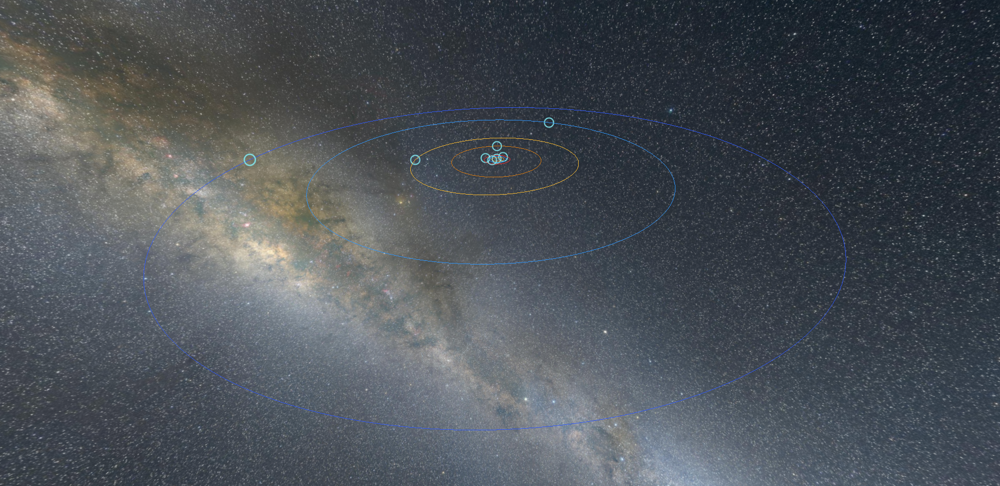
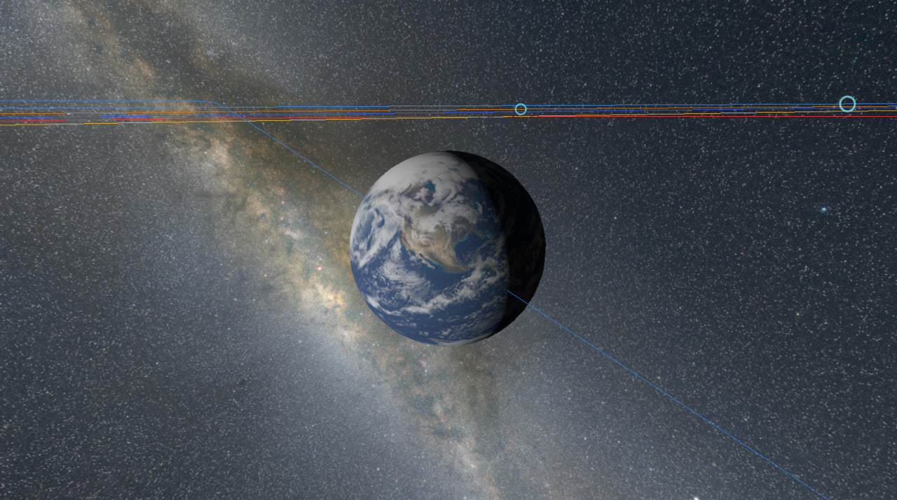
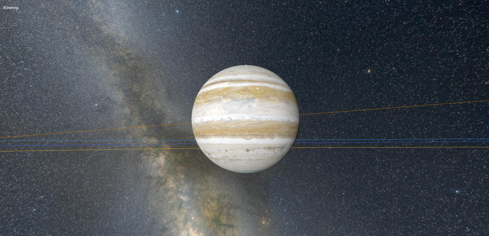

## Моделирование солнечной системы

Все размеры и расстояния совпадают с реальными






## Запуск в Yandex Cloud через terraform

Запуск будет через Yandex Object Storage и его возможность отдавать статический веб контент.

Соберите проект. В папке `dist` появятся собранные файлы:

```shell
vite build
```

Создайте файл `terraform.tfvars` и укажите переменные:

```terraform
cloud_id   = "**************"
folder_id  = "**************"
zone       = "ru-central1-b"
url_prefix = "space-visualizer"  # default
```

Добавьте переменную окружения `YC_TOKEN` с токеном от Yandex Cloud. 
Получить его можно через YC CLI:
```shell
yc iam create-token
```

Либо можно получить [OAuth-токен в сервисе Яндекс ID](https://oauth.yandex.ru/authorize?response_type=token&client_id=1a6990aa636648e9b2ef855fa7bec2fb).
Если приложение запрашивает доступ к данным, разрешите. Это нужно для получения токена.

Теперь запускаем terraform:

```shell
terraform plan;
terraform apply;
```

Вернется URL запущенного сайта.